# Horde Shooter (WIP)
**A Fast-Paced, Highly Optimized FPS built in Unreal Engine 5 & C++**

🎥 Watch the full high-fidelity gameplay and audio showcase on YouTube: [Gameplay Showcase](https://youtu.be/RB3LBlga3Fo)

## 📖 Overview
**Horde Shooter** is a high-speed, retro-inspired Arena Shooter. The primary technical goal of this project is to build a highly scalable, AAA-standard C++ architecture capable of handling heavy combat logic, advanced movement mechanics, and intense visual effects while maintaining strict CPU/GPU performance budgets. 

The project strictly adheres to Object-Oriented principles, decoupling weapon logic from the player controller, and relies heavily on custom physics manipulation rather than default engine tools to achieve precise "Game Feel."

---

## 🏃‍♂️ Movement Architecture & Physics

Instead of relying solely on Unreal's default Character Movement Component, traversal mechanics are strictly state-driven, utilizing dynamic velocity overrides and procedural camera math.

### Dynamic Pedometer (Walking)
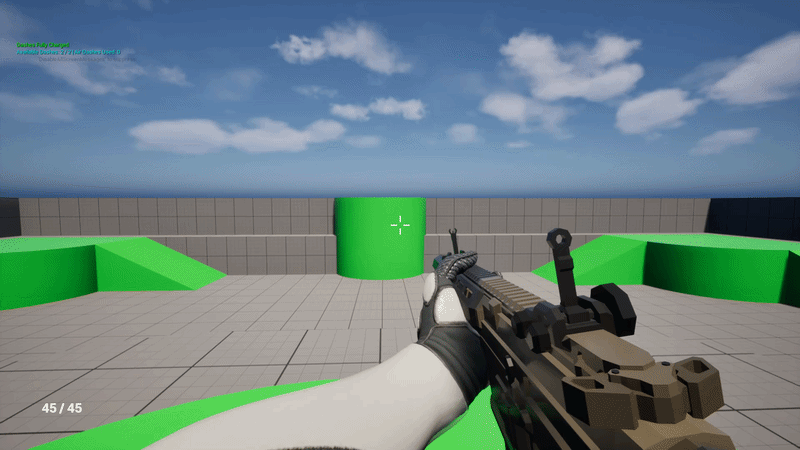

* **The Optimization:** Replaced traditional timer-based or AnimNotify footstep audio with a C++ distance-tracking pedometer. By accumulating `Velocity.Size() * DeltaTime` per frame, the footstep audio frequency automatically scales to any movement speed (walking, running, or being slowed by an effect) with zero reliance on animation states.

### Multi-State Dashing (Ground & Air)

 

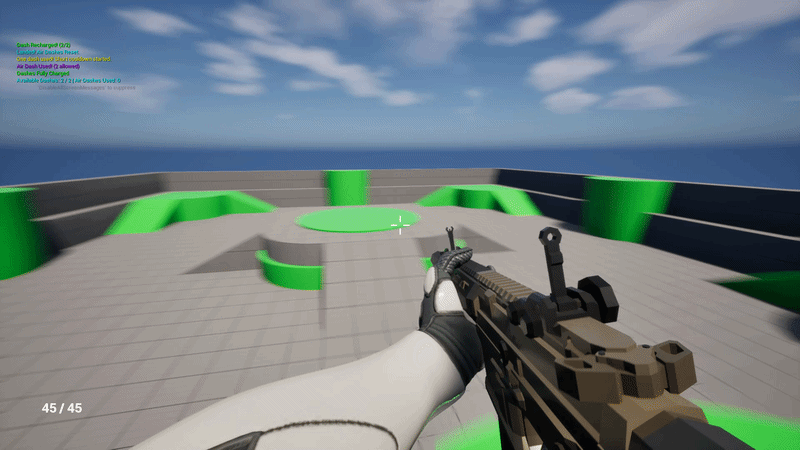

 

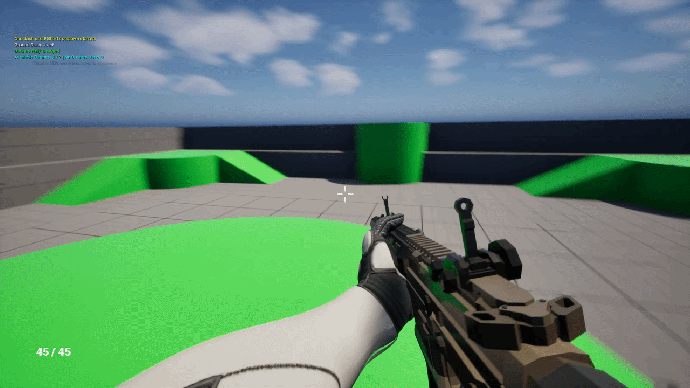

* **The Logic:** Built a *Doom Eternal*-style dual-charge system. Dashing overrides the `Velocity` vector in `Tick` rather than using `LaunchCharacter` impulses. Ground dashes utilize `FVector::VectorPlaneProject` against the floor's normal to seamlessly glide up and down ramps without losing momentum or bouncing.
* **Air Brakes:** Air dashes force the Z-velocity to `0.0f` for a perfect horizontal hover. Upon completion, a custom C++ "Air Brake" clamps horizontal velocity back to standard walk speed, preventing the player from drifting out of control while preserving vertical gravity.

### Frictionless Sliding & Procedural Camera

* **The Logic:** Drops `GroundFriction` to 0.0 and applies a massive directional velocity boost. Slopes dynamically add to momentum by projecting world gravity onto the floor's angle.
* **The Optimization:** Avoids Unreal's native 56-unit camera snap during `Crouch()` by mathematically interpolating the entire Skeletal Mesh's Z-offset in C++. This keeps the First-Person arms and camera perfectly smooth without relying on heavy Animation Blueprints or IK setups.

### Aggressive Jumping
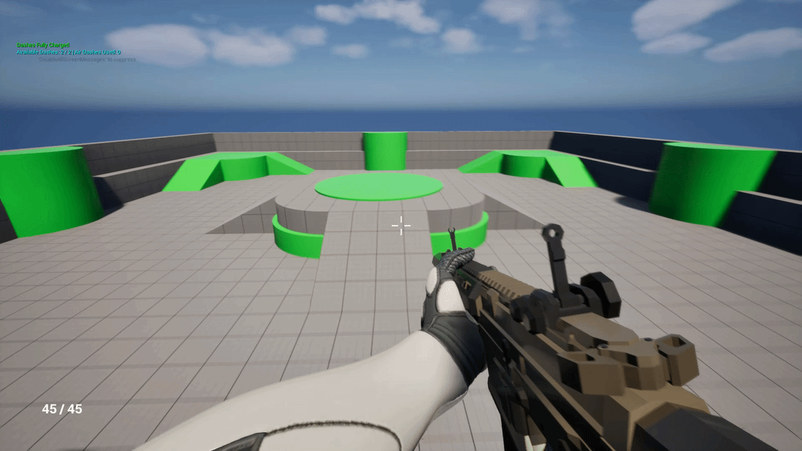

* **The Logic:** Scaled gravity (2.0x) paired with a high `JumpZVelocity` to create an aggressive, fast-falling arc. High `AirControl` and `FallingLateralFriction` allow for instant mid-air directional changes for dodging projectiles.

---

## 🔫 Object-Oriented Combat Architecture

Weapons are entirely decoupled from the Player Character. The player simply delegates inputs (`StartFire`, `StopAltFire`), and the Weapon class handles ammunition, raycasting, and visual/audio feedback.

### Assault Rifle: Gunplay & Procedural Camera Lean
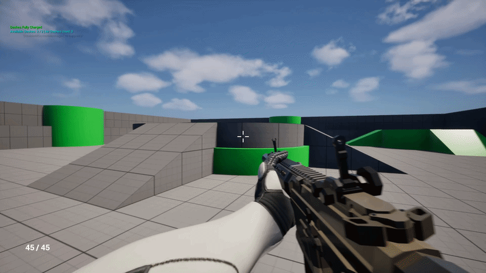

 

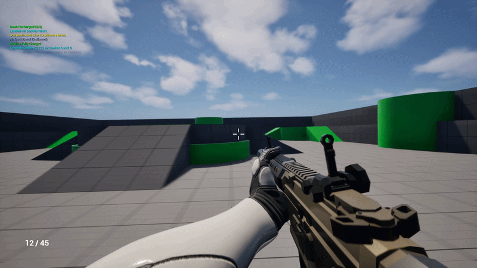

* **The Logic:** Hitscan architecture utilizing `LineTraceSingleByChannel`. Visual recoil uses Additive Animation Montages layered over movement swaying, allowing the player to reload and fire without breaking their running animations.
* **Game Feel (Math-Driven Camera):** Procedural camera lean (Roll) is calculated via the Dot Product of the Actor's Right Vector and current Velocity, generating a physical "lean" when strafing. FOV dynamically stretches based on Forward Velocity.

### Object Pooling: Casing Ejection
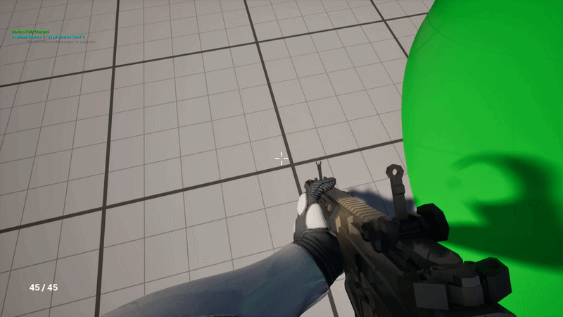

* **The Logic:** Casings inherit the player's anticipated velocity at the moment of ejection so the player's camera never "outruns" the brass when strafing at high speeds. 
* **The Optimization:** Implemented a highly optimized **Object Pool**. 30 casing actors are pre-spawned and hidden at `BeginPlay`. Firing grabs casings via a Round-Robin index. After bouncing once and playing their audio, casings enter a "Physics Coma" (`SetSimulatePhysics(false)`). This drops CPU rigid-body overhead to 0% while the casings remain visible on the floor, completely eliminating Garbage Collection stuttering.

---

## ⚡ The RayGun: Advanced VFX & State Machines

A highly versatile energy weapon utilizing complex state machines for continuous beams and charged AoE attacks.

### Continuous Beam & Pedometer Decals
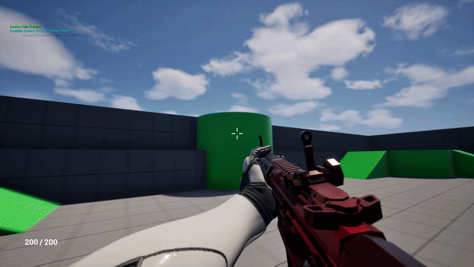

* **The Logic:** Niagara beam parameters (`TraceEnd`) update dynamically in `Tick` to flawlessly track surfaces. 
* **The Optimization:** Spawning decals on `Tick` is a major performance trap. Implemented a distance-based pedometer for Scorch Marks, only spawning a new decal if the laser drags 25+ units across a wall.
* **Material Math:** The burn mark cooling effect uses `Decal Lifetime Opacity` combined with exponential power math (`Exp: 15.0`) to create a CPU-free rapid cooling glow, leaving behind a persistent scorch mark drawn using DBuffer Translucent materials.

### Charged AoE Plasma Detonation
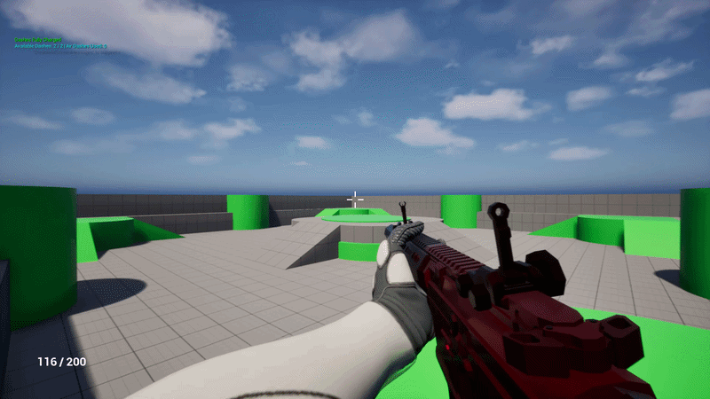

* **The Logic:** Hold-to-charge mechanic overriding the virtual `StartAltFire()` interface. Includes a strict animation-length cooldown lock to prevent spam-firing.
* **The Optimization:** Replaced expensive `GetAllActorsOfClass` loops with Spatial Hashing via `GetWorld()->OverlapMultiByChannel`, locating targets inside the blast radius instantly with near-zero CPU cost. 
* **VFX & Substrate Materials:** The 3D Refractive Plasma bubble passes a scale parameter from C++ directly to Niagara. The material uses a Camera-facing `ScreenPosition` node driving a `Noise` function. This ensures the plasma holes and boiling effect flawlessly face the player from any angle without standard 3D texture pole-pinching.

---

## 🟩 Procedural Arena Generation

To keep combat unpredictable, the level dynamically flattens and shifts into a new layout upon command, utilizing math-driven Instanced Static Meshes (ISMCs) and dynamic NavMesh rebuilding.

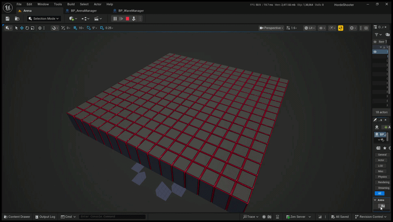  
*Bird's-eye view of the C++ State Machine pulling blocks underground before generating and rising a new, valid layout.*

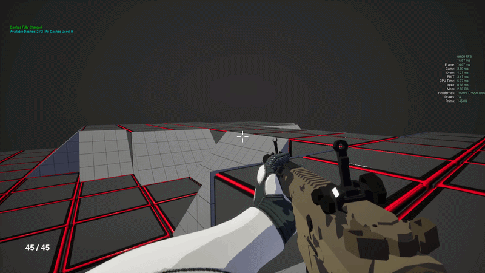  
*Runtime transition viewed from the player's perspective.*

* **The Logic (Noise & Symmetry):** The map topology is generated using layered Perlin Noise, which is quantized into discrete 400-unit steps. The generation coordinates are mirrored bilaterally to give the random noise an intentionally designed, competitive "arena" feel.
* **The Logic (Accessibility Pass):** To ensure enemies can always reach the player, the generator runs an iterative smoothing loop. If a mathematical cliff is too steep to climb (e.g., a 2-block drop), the loop automatically pulls the tall block down into a 1-step staircase, guaranteeing a ramp can spawn.
* **The Optimization (ISMC Batching):** Bypassed Actor spawning entirely. Hundreds of individual cubes and ramps are rendered via Instanced Static Mesh Components. The transition animations update a single `TArray<FTransform>`, pushing the data to the GPU via `BatchUpdateInstancesTransforms` to maintain a locked 60 FPS.
* **The Optimization (NavMesh C++ Locks):** Rebuilding navigation paths while 400 blocks slide up and down would instantly crash the CPU. Instead, the transition State Machine utilizes `AddNavigationBuildLock(ENavigationBuildLock::Custom)`. Once the blocks lock into their final layout, the lock is released and a single, instantaneous Recast rebuild is fired.
* **The "Micro-Weld" Hack:** Prevented Dynamic Recast voxel-tearing on perfect mathematical seams by applying a 1.01f non-uniform scale to ramps. This forces a microscopic 2-unit overlap, guaranteeing contiguous NavMesh paths up 45-degree slopes without gaps.

---

## 🧟 Enemy AI & Horde Systems

The primary constraint for the AI system was strict performance. With a 60 FPS cap, the game has a hard frame budget of 16.67ms to calculate all logic, physics, and rendering.

  
*30+ enemies pathfinding and tracking the player simultaneously while holding a steady 60 FPS on a mid/low-tier target rig.*

To support a massive horde without dropping frames, the AI is built on heavy under-the-hood optimizations:

* **C++ Finite State Machine (10Hz Logic):** Instead of relying on heavy Behavior Trees or running logic in the native `Tick()` function (60+ times a second), the horde runs on a custom, lightweight C++ FSM. The AI brain evaluates and updates its state at a fixed 10 times a second (10Hz). This makes the AI completely framerate independent and drops CPU overhead to near zero.
* **Spatial Hashing over Hitboxes:** Instead of attaching ticking physical collision boxes to enemy hands, the enemy uses `GetWorld()->OverlapMultiByChannel` to sweep for the player at the exact animation frame of the melee strike, completely bypassing continuous physics overlap calculations.
* **Object Pooling:** To prevent massive Garbage Collection spikes during wave spawning, the Horde Manager pre-allocates a pool of inactive enemy actors and recycles them instantly upon death and respawn.
* **VSM & Shadow LOD Culling:** Virtual Shadow Maps are heavily restricted. Enemies only cast Dynamic Capsule Shadows at LOD 0 and LOD 1, completely culling complex shadow calculations at a distance to save massive GPU Draw thread time.
* **Mesh Decimation:** Skeletal Meshes are configured with 4-Tier LODs, drastically decimating polycounts based on screen size.

---

## 🛠️ Tech Stack & Systems Summary
* **Engine:** Unreal Engine 5.4+
* **Language:** C++ / Blueprints (Hybrid Architecture)
* **VFX/Shaders:** Niagara GPU/CPU Compute, Substrate Material Workflows.
* **UI:** Event-Driven UMG. The HUD never ticks. Weapons broadcast Dynamic Multicast Delegates upon firing or reloading, pushing updates to the UI only when memory states explicitly change.